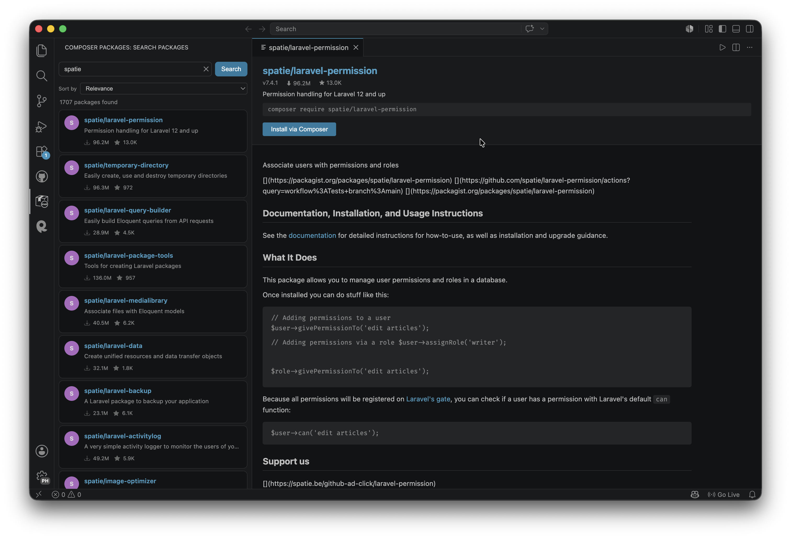

# Composer Packages

Browse, search, and install [Packagist](https://packagist.org) packages directly from the VS Code sidebar — without leaving your editor.

---

## Features

- **Browse popular packages** — Opens with a curated list of the most downloaded Packagist packages, with infinite scroll
- **Search** — Find any package by name or keyword; results load incrementally as you scroll
- **Package details** — Click any package to open a detail panel with version, download stats, and rendered README
- **Install via Composer** — Run `composer require` for any package directly from the extension
- **Open on Packagist** — Jump to the package's Packagist page in your browser with one click

## Installation

### From VS Code Marketplace

1. Open the **Extensions** view (`Ctrl+Shift+X`)
2. Search for **Composer Packages**
3. Click **Install**

## Usage

1. Click the **Composer** icon in the Activity Bar
2. The sidebar loads popular packages automatically
3. Use the search box to find a specific package
4. Click a package card to view its README and details
5. Click **+ Install** to run `composer require <package>` in your workspace terminal
6. Click the link icon (↗) on any card to open the Packagist page in your browser

## Requirements

- VS Code `1.85` or later
- [Composer](https://getcomposer.org) installed and available in your `PATH` (required for the install feature)

## Author

Made by [Aftandil MMD](https://github.com/aftandilmmd)

## License

[MIT](LICENSE)
